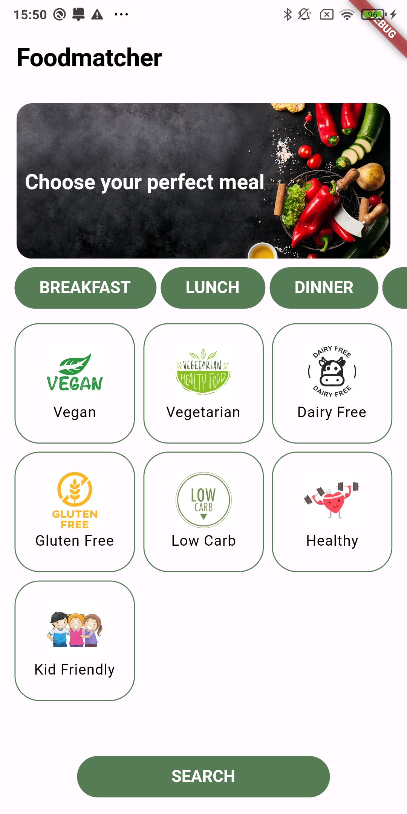
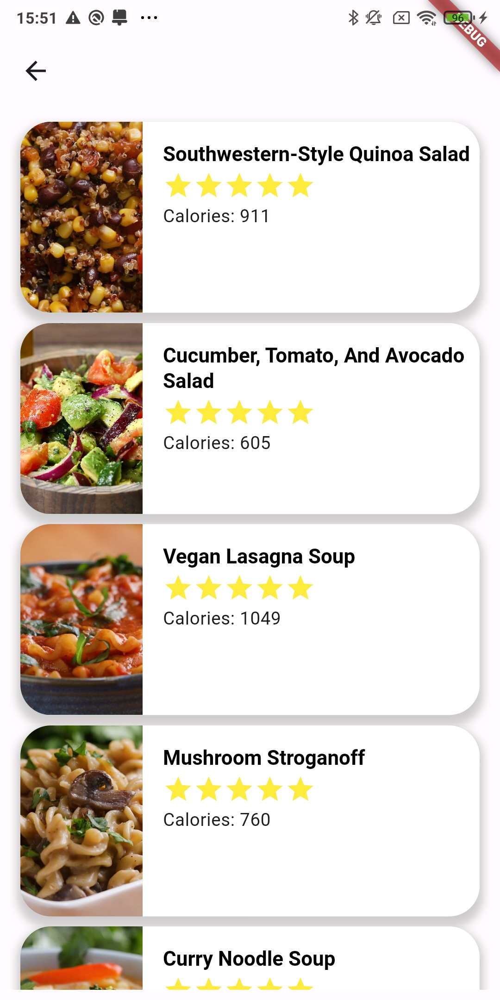
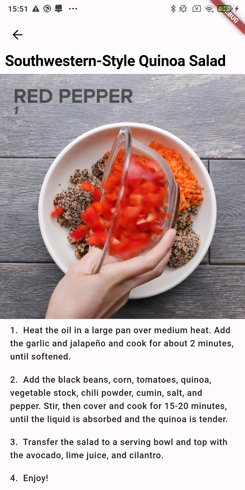

# Dietmatcher

Used [API](https://rapidapi.com/apidojo/api/tasty)
To make application working add lib/api_key.dart file with content: 
final apiKey = "paste your API-KEY here";

Home Screen

Dishes List

Dish details (with video if available)

Error screen- search result empty

